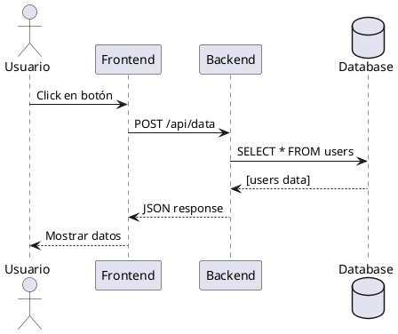
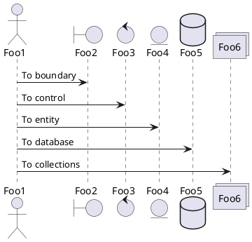
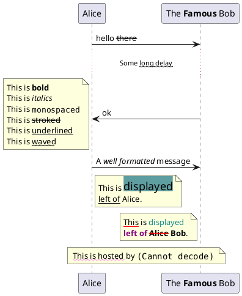
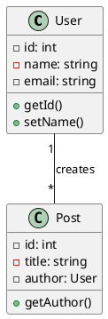
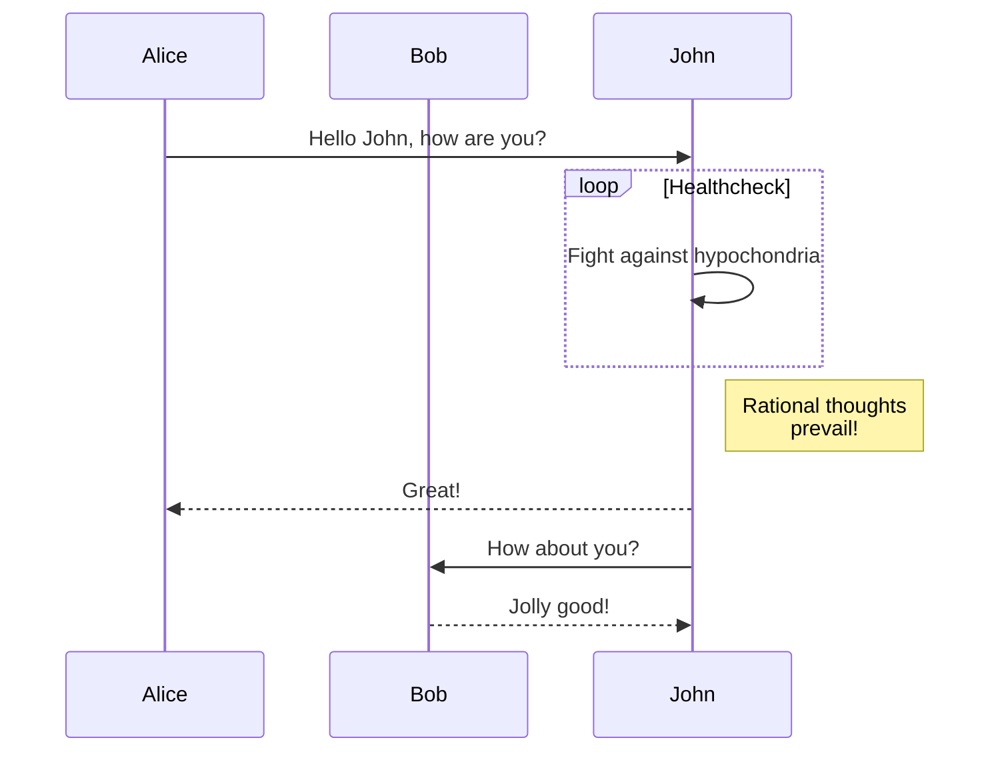

# Test PlantUML - Diagramas UML

Este es un ejemplo de diagrama UML usando PlantUML. Los diagramas se renderizan como SVG escalables.

## Diagrama de Secuencia

# Diagrama

## Diagrama de Clases

## Características

- **Múltiples tipos**: Secuencia, clases, casos de uso, etc.
- **Sintaxis simple**: Lenguaje dedicado fácil de aprender
- **SVG escalable**: Gráficos vectoriales nítidos
- **Integración**: Directamente en markdown

## Casos de uso

PlantUML es ideal para:
- Diagramas de arquitectura
- Flujos de procesos
- Modelado de datos
- Especificaciones técnicas

fruit| price
-----|-----:
apple|2.05
pear|1.37
orange|3.09

[[markmap.md]]